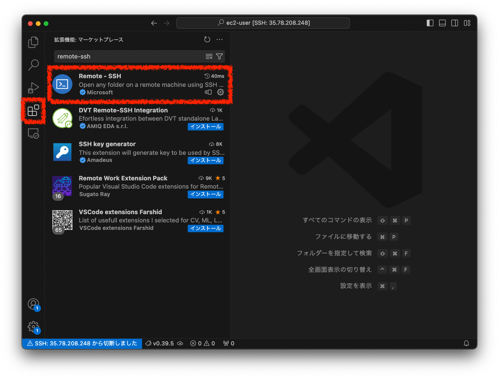

# EC2 インスタンス起動用テンプレート（Cloud9 新規受付停止対応）

## はじめに

- 第 3 回までの課題で利用する EC2 インスタンスを作成する手順です。
- 本手順で起動する EC2 インスタンスは Cloud9 で起動した AmazonLinux2 のインスタンスからイメージを作成しています。
- 本手順の利用は任意です。

> [!NOTE]
> 本手順で EC2 インスタンスを起動するために利用する AWS サービス
>
> - CloudShell
> - CloudFormation  
>   ※これらのサービスについて、現段階で理解する必要はありません。（CloudShell はカリキュラム内では扱いませんが、CloudFormation は第 10 回で学習します。）

## 利用方法

### ① 作成する

> [!IMPORTANT]
> 本手順はすべて、東京リージョンで実行すること。

> [!NOTE]
> 以下に記載されているファイルを事前にダウンロードしておいてください。  
> アップロードするファイル： [template.yml](./template.yml)

- CloudShell を開く
- `template.yml`をアップロードする
- 以下のコマンドをコピー&ペーストして実行する

```bash
aws cloudformation deploy \
    --template-file template.yml \
    --stack-name sample-stack \
    --capabilities CAPABILITY_NAMED_IAM
```


> [!NOTE]
> 作成が完了するまで数分かかります。

### ② 正常に作成されたことを確認する

- CloudShell に`Successfully`と表示されることを確認する
- CloudFormation のコンソールを開く
- sample-stack のステータスが`CREATE_COMPLETE`であることを確認する  
  

### ③ EC2 に接続する

- EC2 のコンソールを開く
- `dev-rasetech-ec2`を選択し、`接続`からセッションマネージャで接続する
- `sudo su ec2-user`でユーザを切り替える
- `cd ~`でホームディレクトリに移動する
- `ruby -v`で ruby が利用できる状態であることを確認する
- `git- v`で git が利用できる状態であることを確認する  
  

> [!TIP]
>
> - シェルの操作は補助教材`CLIの基礎`を活用ください。
> - `cd`コマンドや`ls`コマンドの意味が分からない方は必ず`CLIの基礎`で事前学習するようにしてください。
> - EC2 インスタンスは停止しておくことで料金の発生（無料枠の消費）を抑えることができます。
> - セッションマネージャにはアイドルタイムアウト機能が存在するため、一定時間操作がない状態が継続すると自動的に切断されます。タイムアウトの延長は[こちら](https://docs.aws.amazon.com/ja_jp/systems-manager/latest/userguide/session-preferences-timeout.html)を確認してください。

## EC2 を Terminate（終了）してしまったら

- 誤って EC2 を Terminate（終了）してしまった場合は再度同じ手順で EC2 を起動してください。
- ただし、同名の CloudFormation スタックは存在することはできないため、スタックの削除が必要です。
- 以下にスタックの削除方法を 2 種類紹介します。

### 方法 ① CloudShell で削除コマンドを実行する

- CloudShell を開く
- 以下のコマンドを実行してスタックを削除する

```bash
aws cloudformation delete-stack \
    --stack-name sample-stack
```

- 以下のコマンドを実行し、レスポンスとして sample-stack の情報が出力されることを確認する

```bash
aws cloudformation list-stacks \
    --stack-status-filter DELETE_COMPLETE
```

### 方法 ② CloudFormation コンソールからスタックを削除する

- CloudFormation のコンソール画面を開く
- 対象のスタック（sample-stack）を選択し、削除を選択する
- スタックのステータスが`DELETE_COMPLETE`になったことを確認する
  

## [番外編]VSCode で接続する

- VS Code 及び拡張機能を利用することで、以下の画像のように Cloud9 のような GUI での操作が可能になります。
- コマンド操作に慣れていない方でも直感的に操作することができます。
- こちらの手順を利用した場合もセッションマネージャによる接続は継続して利用ができます。
  

> [!IMPORTANT]
> 既に[利用方法](#利用方法)の手順で構築をしている場合、こちらの手順を実行すると、EC2 インスタンスは新しい EC2 インスタンスに置き換わります。（最初に起動したものは削除され、新しいものが起動されます。）

### ① キーペアを作成する

- EC2 コンソール画面からキーペアを選択する。
  
- 任意の名前を入力し、キーペアを作成する。
  

- ダウンロードしたキーを`~/.ssh/`配下に保存し、以下のコマンドを実行して権限設定を変更する。（WindowsOS の場合、コマンド実行不要）

```bash
chmod 400 ~/.ssh/XXXXXXXXX.pem
```

### ② キーペアを指定して環境構築を行う

- [利用方法](#利用方法)の ① のコマンドを以下に置き換えて実行する。
- ① で作成したキーペアの名前が必要になります。

```bash
aws cloudformation deploy \
    --template-file template.yml \
    --stack-name sample-stack \
    --capabilities CAPABILITY_NAMED_IAM \
    --parameter-overrides KEYPAIRNAME=<キーペアの名前>
```

> [!NOTE]
> <キーペアの名前>の<>は入力しないでください。  
> 入力例）  
> --parameter-overrides KEYPAIRNAME=dev-raisetech-kypr

### ③VS Code で SSH 拡張機能をインストール

- VS Code を開いて、`Remote-SSH`をインストールする。
  

### ④ 拡張機能を使って接続する

- [公式ドキュメント](https://code.visualstudio.com/docs/remote/ssh)を参照して、進めてください。
- 本機能の利用については、個人ブログも多数投稿されていますので、必要に応じてそれらも活用しましょう。

> [!NOTE]
> 一定時間操作がないと、自動的に SSH 接続は切断されます。
> これを延長する方法もありますので、調べて対応してみてください。

### 最後に

本機能は広く知られているものであり、手順の中にも記載しましたが、多数の個人ブログの投稿がされています。③ の手順以降、多少躓いたとしても、WEB 検索を活用することで多くの場合解消できるものと推測できますので、質問投稿にまず自身で対応を試みてみましょう！  
もちろん質問はいつでも受け付けていますので、お気軽に活用ください。
