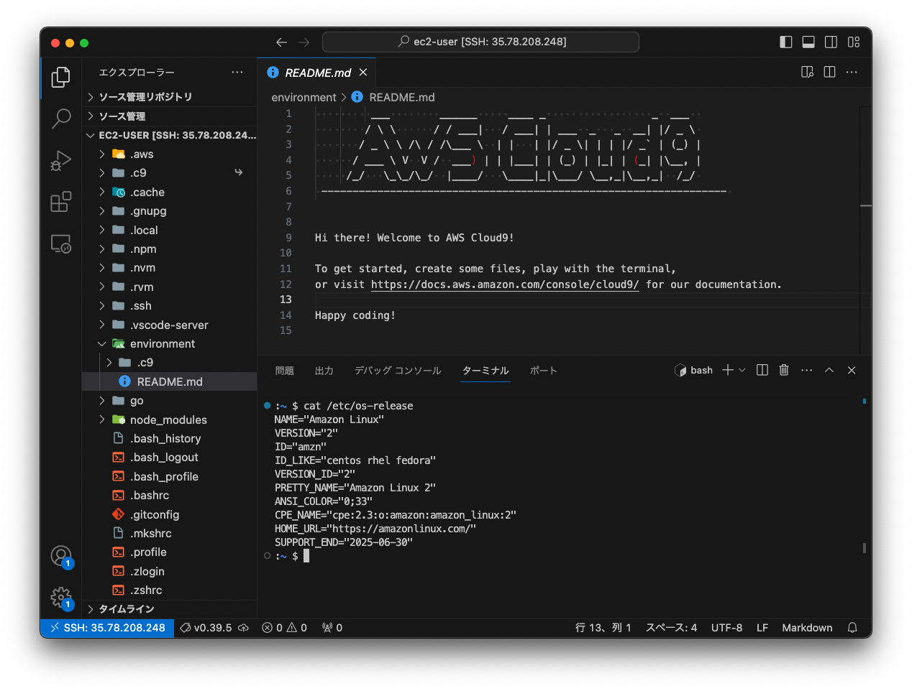

# 第 3 回講座 サポート資料

・[rvm のインストール](#rvm-のインストール)  
・[vi コマンド](#vi-コマンド)
・[vscode で接続する](#番外編vscode-で接続する任意・オプション)

## rvm のインストール

### rvm とは

RVM（Ruby Version Manager）は、複数の Ruby バージョンを 1 つのシステムで管理するツールです。  
特定の Ruby のバージョンをインストールしたり、インストールされた Ruby のバージョンの中から利用したいバージョンに切り替えることができます。

### インストール手順

参考）本手順は[こちら](https://rvm.io/rvm/install)を参考にしています。

1. ユーザの切り替えとホームディレクトリへ移動

- 実行するコマンド

```bash
$ sudo su ec2-user
$ cd ~
```

- 期待する実行結果のサンプル  
  表示なし

2. GPG キーのインストール

- 実行するコマンド

```bash
$ gpg --keyserver keyserver.ubuntu.com --recv-keys 409B6B1796C275462A1703113804BB82D39DC0E3 7D2BAF1CF37B13E2069D6956105BD0E739499BDB
```

- 期待期待する実行結果のサンプル

```bash
gpg: directory `/home/ec2-user/.gnupg' created
gpg: new configuration file `/home/ec2-user/.gnupg/gpg.conf' created
gpg: WARNING: options in `/home/ec2-user/.gnupg/gpg.conf' are not yet active during this run
gpg: keyring `/home/ec2-user/.gnupg/secring.gpg' created
gpg: keyring `/home/ec2-user/.gnupg/pubring.gpg' created
gpg: requesting key D39DC0E3 from hkp server keyserver.ubuntu.com
gpg: requesting key 39499BDB from hkp server keyserver.ubuntu.com
gpg: /home/ec2-user/.gnupg/trustdb.gpg: trustdb created
gpg: key D39DC0E3: public key "Michal Papis (RVM signing) <mpapis@gmail.com>" imported
gpg: key 39499BDB: public key "Piotr Kuczynski <piotr.kuczynski@gmail.com>" imported
gpg: no ultimately trusted keys found
gpg: Total number processed: 2
gpg:               imported: 2  (RSA: 2)

```

3. rvm のインストール

- 実行するコマンド

```bash
$ \curl -sSL https://get.rvm.io | bash
```

- 期待する実行結果のサンプル

```bash
Downloading https://github.com/rvm/rvm/archive/master.tar.gz
Installing RVM to /home/ec2-user/.rvm/
    Adding rvm PATH line to /home/ec2-user/.profile /home/ec2-user/.mkshrc /home/ec2-user/.bashrc /home/ec2-user/.zshrc.
    Adding rvm loading line to /home/ec2-user/.profile /home/ec2-user/.bash_profile /home/ec2-user/.zlogin.
Installation of RVM in /home/ec2-user/.rvm/ is almost complete:

  * To start using RVM you need to run `source /home/ec2-user/.rvm/scripts/rvm`
    in all your open shell windows, in rare cases you need to reopen all shell windows.
Thanks for installing RVM 🙏
Please consider donating to our open collective to help us maintain RVM.

👉  Donate: https://opencollective.com/rvm/donate

```

4. rvm の読み込み

- 実行するコマンド

```bash
$ echo "source $HOME/.rvm/scripts/rvm" >> ~/.bash_profile
$ source .bash_profile
```

- 期待する実行結果のサンプル  
  表示なし

5. インストール完了確認

- 実行するコマンド

```bash
$ rvm -v
```

- 期待する実行結果のサンプル

```bash
rvm 1.29.12-next (master) by Michal Papis, Piotr Kuczynski, Wayne E. Seguin [https://rvm.io]
```

## vi コマンド

### vi コマンドとは

Linux（UNIX） の標準のテキストエディタを起動するコマンドです。ファイルの内容を確認したり、修正する際に利用します。

### 使い方

下記の記事でわかりやすく紹介されています。こちらに記載されている内容を全て覚える必要はありません。やりたいことを調べるための辞書のような使い方をおすすめします。  
https://tech-blog.rakus.co.jp/entry/20210715/vi

## [番外編]VSCode で接続する（任意・オプション）

- VS Code 及び拡張機能を利用することで、以下の画像のように Cloud9 のような GUI での操作が可能になります。
- コマンド操作に慣れていない方でも直感的に操作することができます。
- こちらの手順を利用した場合もセッションマネージャによる接続は継続して利用ができます。
  

> [!IMPORTANT]
> 既に[README.md](README.md)の手順で構築をしている場合、こちらの手順を実行すると、EC2 インスタンスは新しい EC2 インスタンスに置き換わります。（最初に起動したものは削除され、新しいものが起動されます。）

### ① キーペアを作成する

- EC2 コンソール画面からキーペアを選択する。
  
- 任意の名前を入力し、キーペアを作成する。
  

- ダウンロードしたキーを`~/.ssh/`配下に保存し、以下のコマンドを実行して権限設定を変更する。（WindowsOS の場合、コマンド実行不要）

```bash
chmod 400 ~/.ssh/XXXXXXXXX.pem
```

### ② キーペアを指定して環境構築を行う

- [README.md](README.md)の ① のコマンドを以下に置き換えて実行する。
- ① で作成したキーペアの名前が必要になります。

```bash
aws cloudformation deploy \
    --template-file template.yml \
    --stack-name sample-stack \
    --capabilities CAPABILITY_NAMED_IAM \
    --parameter-overrides KEYPAIRNAME=<キーペアの名前>
```

> [!NOTE]
> <キーペアの名前>の<>は入力しないでください。  
> 入力例）  
> --parameter-overrides KEYPAIRNAME=dev-raisetech-kypr

### ③VS Code で SSH 拡張機能をインストール

- VS Code を開いて、`Remote-SSH`をインストールする。
  

### ④ 拡張機能を使って接続する

- [公式ドキュメント](https://code.visualstudio.com/docs/remote/ssh)を参照して、進めてください。
- 本機能の利用については、個人ブログも多数投稿されていますので、必要に応じてそれらも活用しましょう。

> [!NOTE]
> 一定時間操作がないと、自動的に SSH 接続は切断されます。
> これを延長する方法もありますので、調べて対応してみてください。

### 最後に

本機能は広く知られているものであり、手順の中にも記載しましたが、多数の個人ブログの投稿がされています。③ の手順以降、多少躓いたとしても、WEB 検索を活用することで多くの場合解消できるものと推測できますので、質問投稿にまず自身で対応を試みてみましょう！  
もちろん質問はいつでも受け付けていますので、お気軽に活用ください。
